
Interfacial Dzyaloshinski-Moriya interaction and Kerr microscopy

 Sreekar 

---

# Spintronic Storage Technology

---

# Magnetic interactions

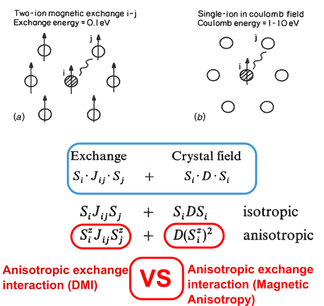

- Origin of either types of anisotropic interactions is spin-orbit interaction.
- Refer [O' Handley, Chapter on Magnetic Anisotropy](O' Handley Book, Chapter on Magnetic Anisotropy), [Yosida, Chapter : Interactions](Yosida, Chapter on Exchange Interactions)

---

# Magnetic ordering
\\[ H_{H} \sim \mathbf{S}_i \cdot \mathbf{S}_j \\]

- Isotropic exchange interactions (Heisenberg exchange) is symmetric interactions hence favour a **collinear** magnetic order

- To explain the "weak" ferromagnetism observed in antiferromagnetic Fe_{2}O_{3}, [Dzyaloshinsky(1957)](Dzyaloshinsky(1957)) invoked the idea of non collinear magnetic ordering based the crystal symmetry and giving a **phenomenological** expression
\\[ H_{DMI} \sim \mathbf{D} \cdot ( \mathbf{S}_i \times \mathbf{S}_j )\\]

- [Moriya(1960)](Moriya(1960)) related the weak ferromagnetism to the anisotropic exchange interaction from **first principles**
- DMI interaction is antisymmetric hence can stabilize **non-collinear** magnetic ordering

---

# Bulk DMI -> Interfacial DMI

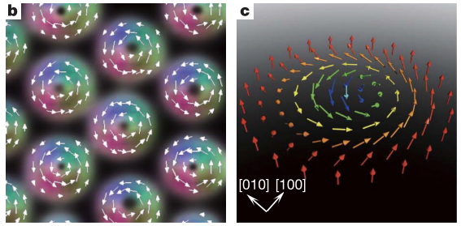

- Direct observation of helical order in bulk FeCoSi [Tokura Group](Tokura Group)
- Why it is gained prominence in spintronics
- How does one characterize DMI?

# Structural inversion symmetry breaking

- SOC can be visualized as the interaction of the electron spin with the magnetic field the electron "sees" as it moves throught the electric field
\\[ ~(\nabla V \times p)\cdot s \\]
- At interfaces, large electric fields

---

# Interfacial DMI characterization

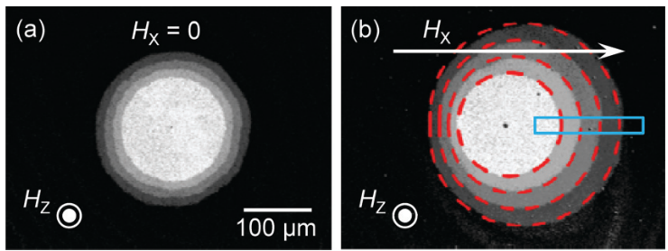

- Spin-polarized STM [Wiesendanger 2007](Wiesendanger 2007)

- Kerr microscopy [Je PRB (2013)](Je PRB (2013))

- Skyrmion observation [Beach Group](Beach Group)

<figure class="video_container">

<video controls width="250">

    <source src="content/video2.mp4"
            type="video/mp4">

    Sorry, your browser doesn't support embedded videos.
</video>

</figure>

---

# Characterizing interfacial-DMI using Kerr microscopy

---

# Magneto-optic effect

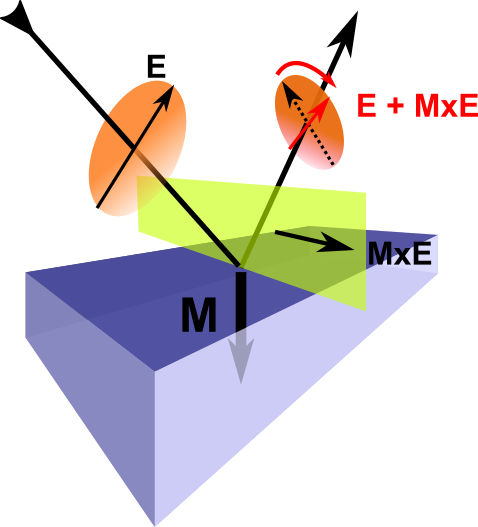

- Light travelling in a magnetic medium an extra complex dielectric response

\\[ \mathbf{D} = \epsilon ( \mathbf{E} + i Q_V \mathbf{m} \times \mathbf{E})\\]

- The **lorenz force** gives a complex faraday rotation of the polarization vector

- Why it is enhanced in the polar configuration?

---

# Kerr microscopy : instrumentation

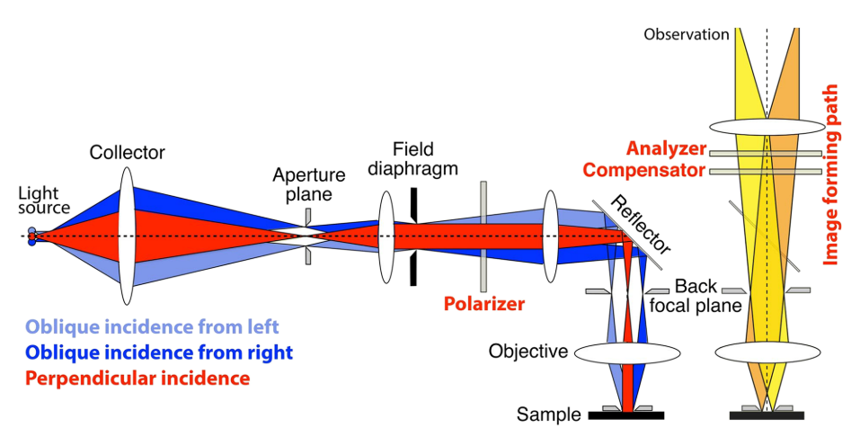

- plane of the aperture is conjugate to the back focal plane of the objective (Diffraction plane).
- This diffraction plane is seen in the **conoscopic lens** of the microscope.
- What makes detecting low contrast signals possible?
- Typical parameters for our system (SI units)

---

# System

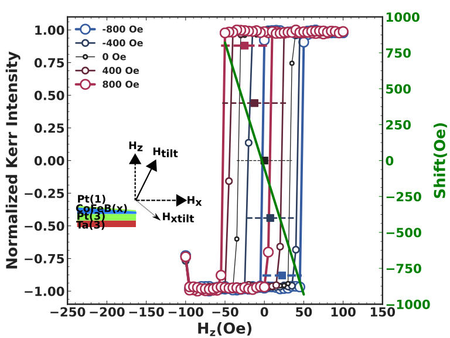

- Quasi PMA is established in Ta(3)Pt(3)CoFeB(0.5)Pt(1) using a measurement protocol that enhances the sensitivity for low tilt angle measurements
- Typical tilt angles of 0.7-3 degrees

---

# Measurement Protocol

- System : Ta(3)Pt(3)CoFeB(0.50)Pt(1) with CoFeB without rotation.
- Stabilize IP field (H_x)
- Nucleate bubble domain by Hz = -41 Oe with pulse of order 100 ms.
- Apply another Hz pulse of varying pulse width according to the strength of Hz.
- This experiment is repeated for Hz = {-42,60} Oe in steps of 1 Oe and varying Hx = {-900, 900} Oe in steps of 100 Oe.
- We observe shift in the center of bubble domain along with domain wall expansion .

---

# Analysis

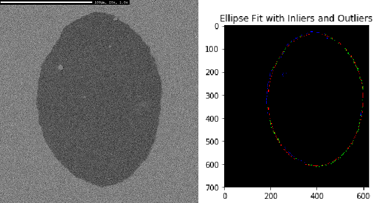

!python
import cv2 		% OpenCV for Image Processing
import numpy as np	% for Linear Algebra
import matplotlib.pyplot as plt % for plotting

---

#Results

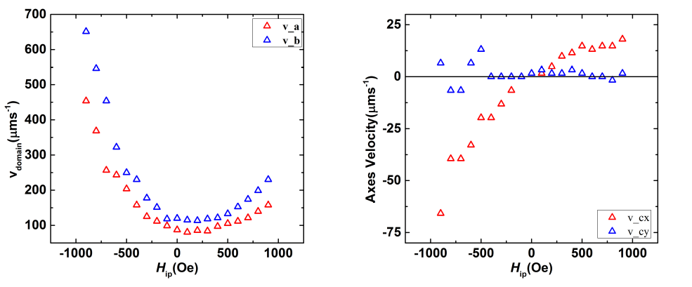

- We observe the monotonic dependence of the domain drift with Hx.
- Further, the strength of this dependence increases with increase in Hz.

---

#Results

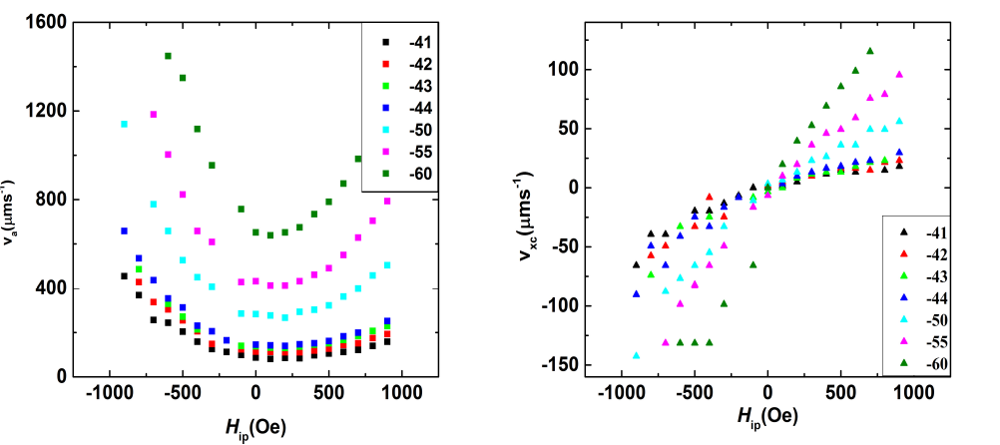

---

# Results

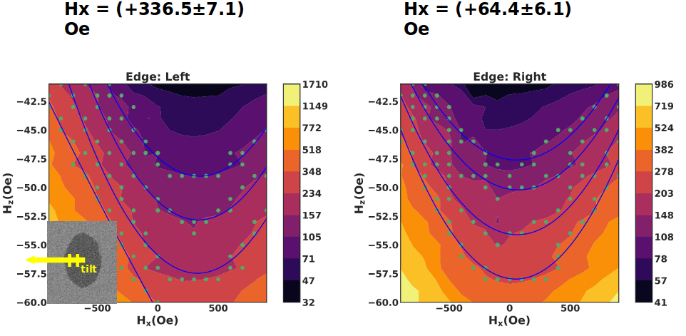

---

# Interplay of Tilted anisotropy and DMI in quasi PMA Ta/Pt/CoFeB/Pt

---

# Here comes *Je et. al.*

- What are the salient features of this characterization

- Creep law... OK what is it... please explain

- Why do you get elliptical domain walls instead of circular walls?

- Stability of the domains

---

# Stripe domains to bubble domains : Why?

- Thiele gave first shot \[1970\]

- Single Domain Analysis results in a Quality Factor

- Quality factor is relation between anisotropy constant and the stray field energy coefficient

- insert the math equation here

---

# Rewind back to 1970

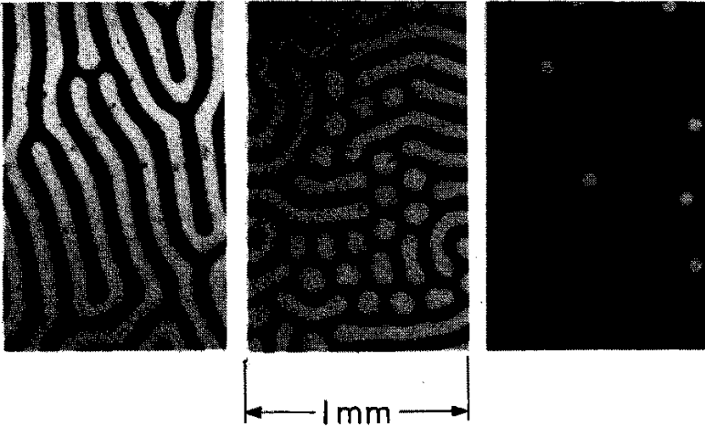

- bubble memory were the state-of-art

- insert the bubble memory picture here

# Presenter Notes

During the 1970 bubble memory was discovered in orthoferrites exhibiting perpendicular magnetic anisotropy. Researchers at Phillips and Bell Labs studied slices of single crystal rare earth orthoferrites with thickness ranging in 10 microns using Faraday effect and observed that these domains could be moved with inhomogeneous magnetics fields with relative ease as they had low wall motion coercivity. Thiele, who is an important theoretician in magnetic domains community came up with the first theory of stability of such bubble domains.
